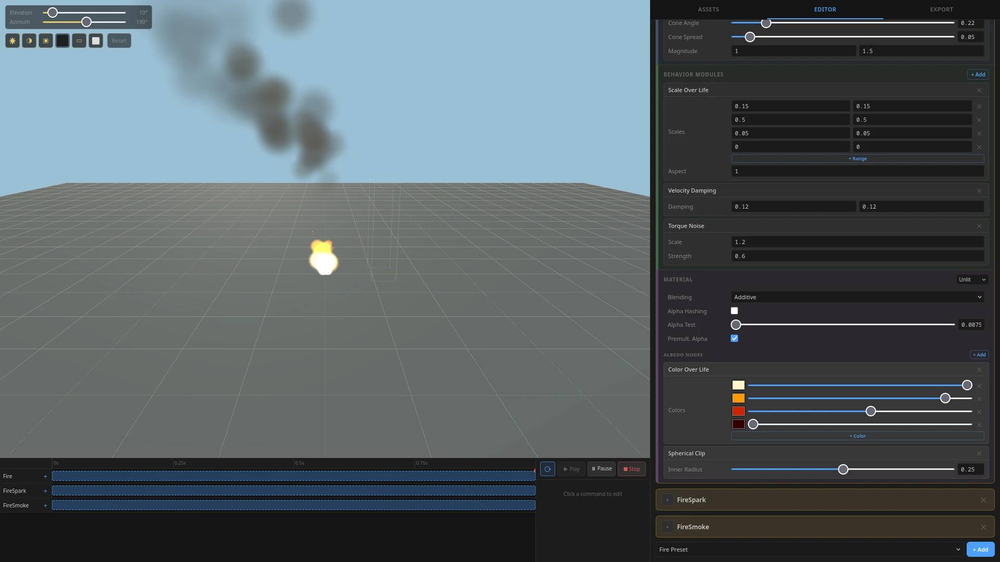

# sparcoon

[](https://www.npmjs.com/package/sparcoon)
[](https://opensource.org/licenses/MIT)

Instanced-mesh particle system for Three.js.

## Editor

Interactive visual **[EDITOR](https://jango-git.github.io/sparcoon/)**



## API

- **FXEmitter** extends `Object3D`. Manages emission, lifetime, pooling, rendering. One draw call per emitter. Optional back-to-front sorting.
- **Spawn modules** set initial particle state: position (box/sphere/point), velocity (cone), rotation, scale, lifetime. Numeric params accept ranges.
- **Behavior modules** update particles per frame: directional/point force, velocity/torque damping, simplex noise, scale-over-life, velocity/torque over lifetime.
- **Materials**: `FXUnlitMaterial` (MeshBasicMaterial), `FXDiffuseMaterial` (MeshLambertMaterial + optional subsurface scatter). Shadow support.
- **Nodes** are composable material inputs: color-over-life, static/animated textures, normals (flat/spherical/map).

## Example

Smoke volume with animated sprite sheet, subsurface scattering, and shadow receiving:

```typescript
const RATE = 10;
const LIFETIME = 6;

const smoke = new FXEmitter(
  [
    new FXSpawnBox(areaMin, areaMax),
    new FXSpawnLifetime({ min: LIFETIME * 0.5, max: LIFETIME }),
    new FXSpawnScale({ min: 8, max: 16 }),
    new FXSpawnRotation(),
  ],
  [],
  new FXDiffuseMaterial({
    enableScatter: true,
    scatterPower: 10,
    forwardScatterStrength: 1,
    backScatterStrength: 0.25,
    shadowSensitivity: 0.25,
    premultipliedAlpha: true,
    albedoNodes: [
      new FXNodeAnimatedTexture({
        texture: smokeAtlas,
        rows: 8,
        columns: 8,
        interpolate: true,
      }),
      new FXNodeColorOverLife([
        new FXColor(0xffffff, 0),
        new FXColor(0xffffff, 0.4),
        new FXColor(0xffffff, 0.4),
        new FXColor(0xffffff, 0),
      ]),
    ],
  }),
  {
    expectedCapacity: Math.ceil(LIFETIME * RATE) + 1,
    receiveShadow: true,
    sortCamera: camera,
    sortFraction: 0.25,
  },
);

scene.add(smoke);
smoke.play(RATE);

// render loop
FXEmitter.onWillRender(delta);
```

## Install

```
npm install sparcoon
```

Peer dep: `three` >=0.157.0 <0.180.0

## License

MIT
